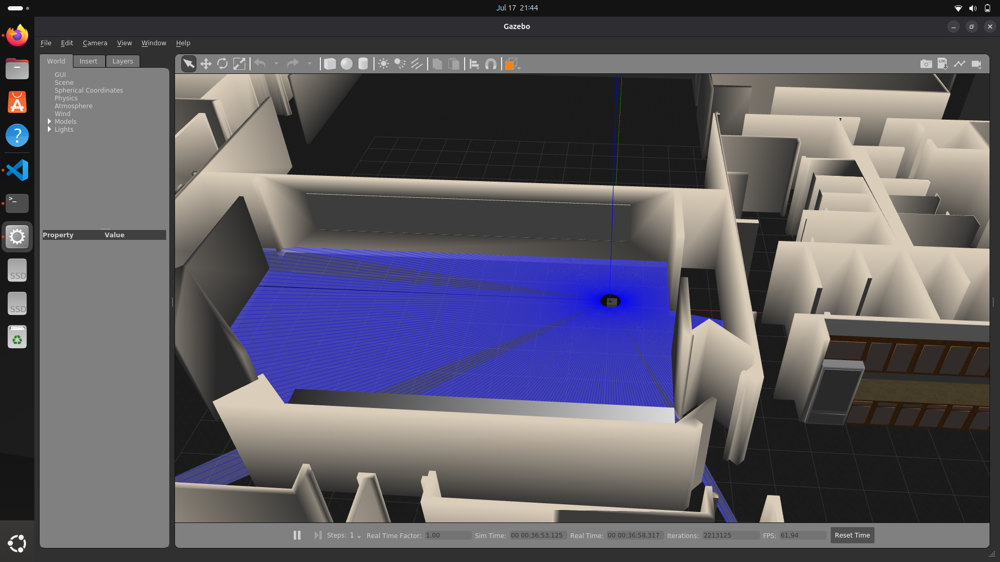
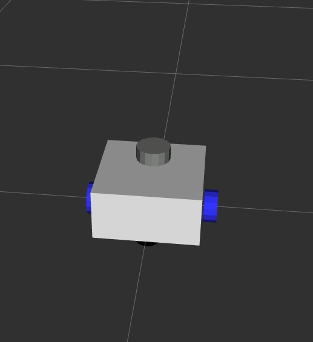
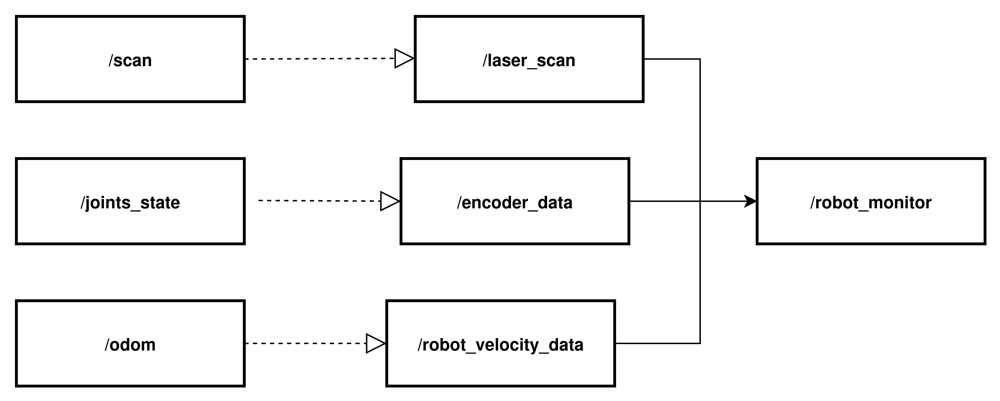
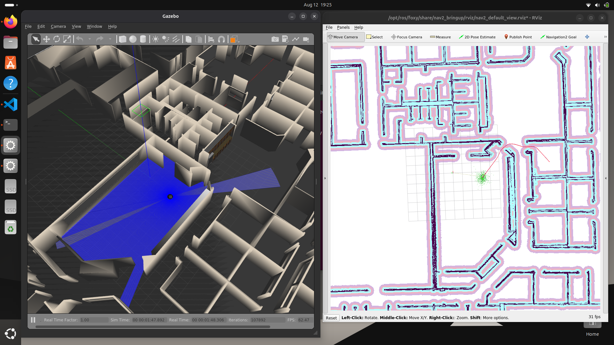

# praca_inz

## Cel

Celem projektu jest stworzenie symulacji w ROS2 oraz Gazebo. Następnie zbierane są dane z symulacji z czujników oraz odometrii, w celu estymacji prędkości robota przez model sztucznej inteligencji.

## Etap 1 - ROS2 i Gazebo

Pierwszym etapem było stworzenie symulacji w środowisku ROS2 Foxy. Podczas symulacji miały być zbierane dane z odometri robota, skany laserowe z lidaru. Należało zmapować teren, aby móc zadawać robotowi pozycję, gdzie ma się przemieścić.

### Budowa robota

<div class="grid" markdown>





</div>

### Zbieranie danych

Zbieranie danych odbywa się na zasadzie przedstawionej poniżej.



W tym celu wykorzystywane są topici:  */joint_states* ,  */scan*  oraz */odom*. Następnie klasy związane z: prędkościami enkoderów, skanami z lidara oraz odometrią przetwarzają w odpowiedni sposób wiadomości z tych topiców. Potem publikują nowe, odpowiednie wiadomości (zdefiniowane w folderze msg) do nowych topików. Później dane są synchronizowane w czasie, dzięki paczce [MessageFilter](https://docs.ros.org/en/rolling/p/message_filters/), zaimplementowanej w klasie *RobotMonitor*. Następnie dane są "nagrywane" przez *rosbaga*, który subskrybuje topic */robot_monitor.*

```python
    rosbag_record = ExecuteProcess(
        cmd=['ros2', 'bag', 'record', '-o', './src/robot/bag_files/data1', '/robot_monitor'],
        output='screen'
    )
```

### Mapowanie

Kolejnym krokiem było mapowanie terenu. W tym celu wykorzystano gotowy świat z Gazebo - [WillowGarage](https://github.com/arpg/Gazebo/blob/master/worlds/willowgarage.world). Włączono symulację w Gazebo. Następnie wykorzystano launchfile online_async_launch z paczki slamtoolbox, aby zmapować teren. W celu sprawdzenie poprawności mapy uruchomiono program rviz2. Aby poruszać się robotem wykorzystano teleop.

```bash
ros2 launch robot launch_sim_launch.py world:=./src/robot/worlds/willowgarage.world

ros2 launch slamtoolbox online_async_launch.py use_sim_time:=true

ros2 run rviz2 rviz2 -d /opt/ros/foxy/share/nav2_bringup/rviz/nav2_default_view.rviz 

ros2 run teleop_twist_keyboard teleop_twist_keyboard --ros-args -r /cmd_vel:=/diff_controller/cmd_vel_unstamped
```

### Nawigacja

Po uruchomieniu świata Gazebo, włączono nav2_bringup, aby umożliwić nawigację robota. Włączono Rviza, aby mieć podgląc, jak przebiega nawigacja w świecie. Dodatkowo użyto *twist_mux*, aby móc korzystać z 2 źródeł dla prędkości - z nav2 oraz teleop.

```bash
ros2 launch robot launch_sim_launch.py world:=./src/robot/worlds/willowgarage.world

ros2 launch nav2_bringup bringup_launch.py use_sim_time:=true autostart:=true map:=map_save2.yaml

ros2 run rviz2 rviz2 -d /opt/ros/foxy/share/nav2_bringup/rviz/nav2_default_view.rviz 

ros2 run twist_mux twist_mux --ros-args --params-file src/robot/config/twist_mux.yaml -r cmd_vel_out:=diff_controller/cmd_vel_unstamped
```

